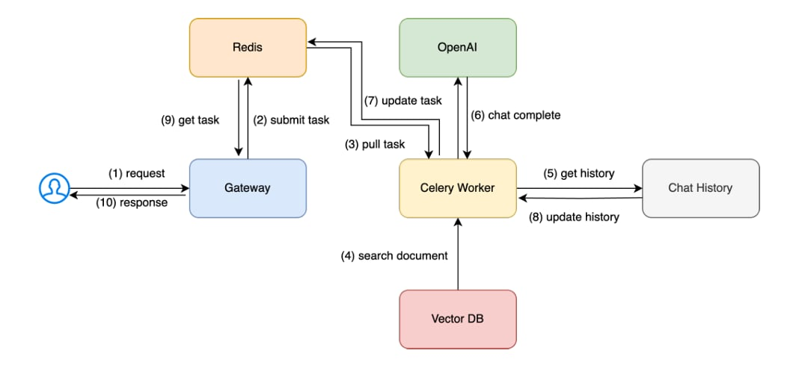
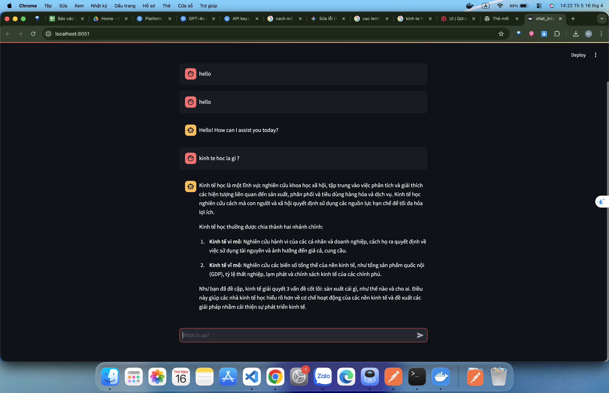

# demo_rag

Demo RAG chatbot with backend API + worker, Valkey queue/cache, Qdrant vector DB, MariaDB, va UI.

## He thong


## Demo bot


## Quick start
1) Create network:
```
docker network create internal-network
```

2) Backend:
```
cd backend
docker compose up -d --build
```

3) Frontend:
```
cd ../chatbot-ui
docker compose up -d --build
```

4) MariaDB:
```
cd ../mariadb
docker compose up -d
```

## Backend (backend/)
- Deploy: `docker compose up -d --build`
- Logs:
	- `docker logs -f chatbot-api`
	- `docker logs -f chatbot-worker`
- Ports:
	- API: 8000
	- Valkey: 6379
	- Qdrant: 6333/6334
- Vector DB dashboard: http://localhost:6333/dashboard#/collections/llm

## Frontend (chatbot-ui/)
- Run: `docker compose up -d --build`
- Port: 8051

## MariaDB (mariadb/)
- Run: `docker compose up -d`
- Stop: `docker compose down`
- Access:
	- `docker exec -it mariadb-tiny bash`
	- `mysql -u root -p`
- Port: 3308 -> 3306
